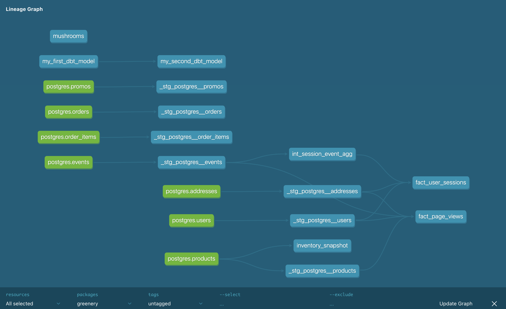

# Week 2 Project

## Part 1. Models

### What is our user repeat rate? 
**0.798387%**

### What are good indicators of a user who will likely purchase again? What about indicators of users who are likely NOT to purchase again? If you had more data, what features would you want to look into to answer this question?
I woudl really explore very different correlation: 
> **Age of buyer**
> **Date of purchase (is it close to a specific event like Valentine date etc.)**
> **Duration of the session - for potential correlation between long session and repeat purchase**
> **Type of product order - some product might be indicative of a higher probability of repeat purchase**
> **Contact to Customer Serivce**
> **User behavior on the website - eg. certain pages clicked etc.**

I would do multiple linear regression analysis and then a multilinear regression analysis.

### More stakeholders are coming to us for data, which is great! But we need to get some more models created before we can help. Create a marts folder, so we can organize our models, with the following subfolders for business units:
**LINK from github [TO ADD]**
**Product:**
fact_page_views, fact_user_sessions

        
### Explain the product mart models you added. Why did you organize the models in the way you did?

**Product:**
> **fact_user_sessions:**
    This model is aggregated at the session level and shows how many events happened while also providing information related to the user. It also provides the length of the session.

> **fact_page_views:**
    This model provides view solely on page_view events and allows to aggregate on different dimension: product - eg. product price - but also user - eg. user's state or user's time of creation. This will allow to perform analysis on these dimensions. 

### Use the dbt docs to visualize your model DAGs to ensure the model layers make sense

![

## Part 2: Tests

### What assumptions are you making about each model? (i.e. why are you adding each test?)

Mainly, I want to make sure that unique key are unique and some key columns don't have null values.

I would try to add a test about certain expected values: for example, making sure that a url has the right url part in it.

### Did you find any “bad” data as you added and ran tests on your models? How did you go about either cleaning the data in the dbt model or adjusting your assumptions/tests?

### Your stakeholders at Greenery want to understand the state of the data each day. Explain how you would ensure these tests are passing regularly and how you would alert stakeholders about bad data getting through.

## Part 3: dbt Snapshots

### Run the product snapshot model using dbt snapshot and query it in snowflake to see how the data has changed since last week

